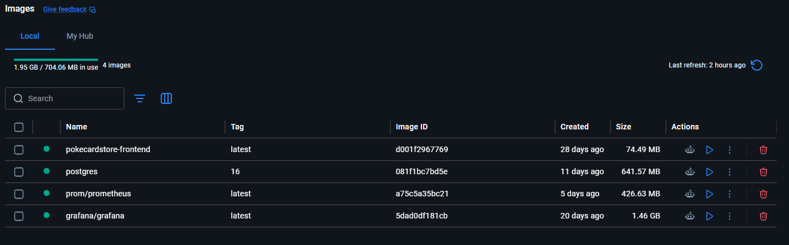
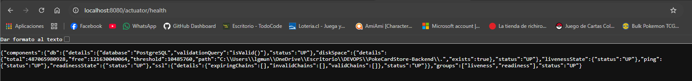
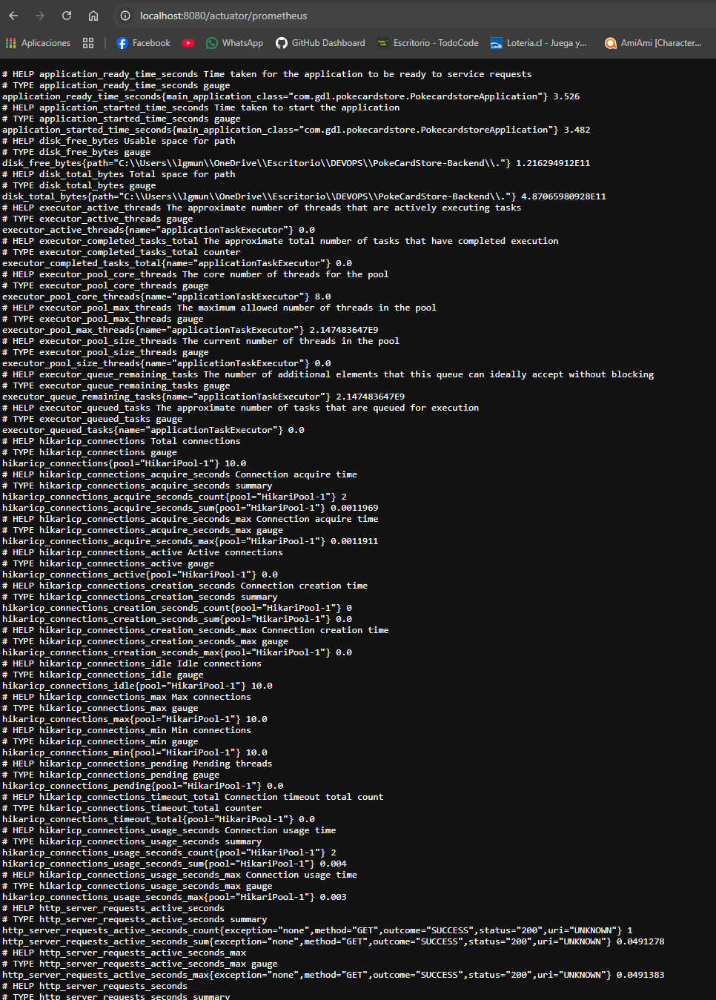
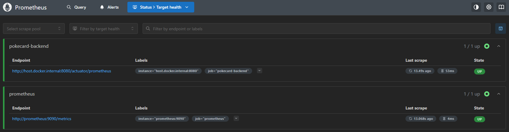
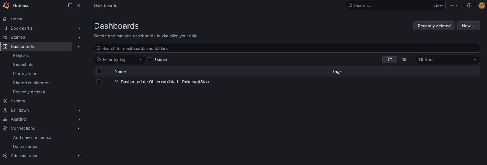
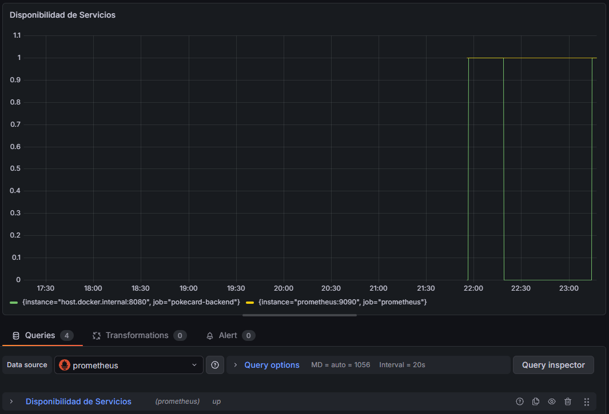
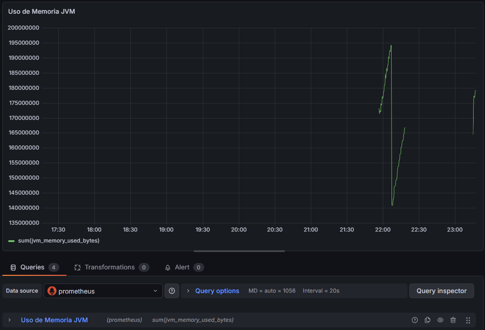
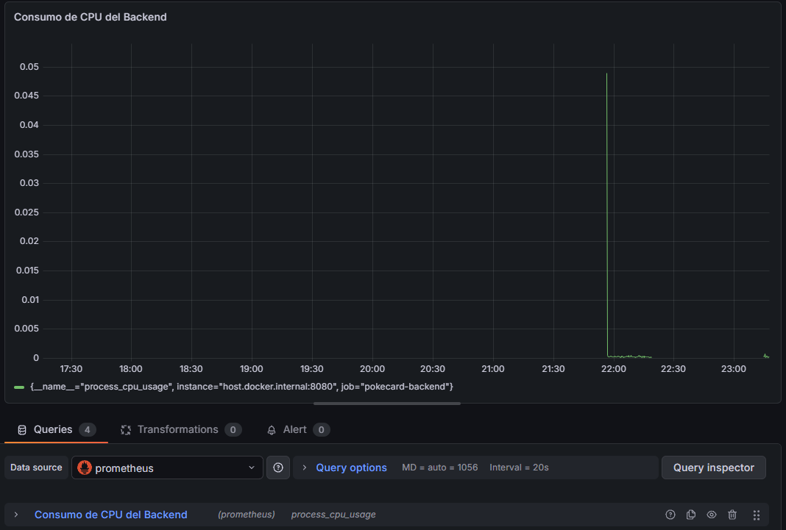
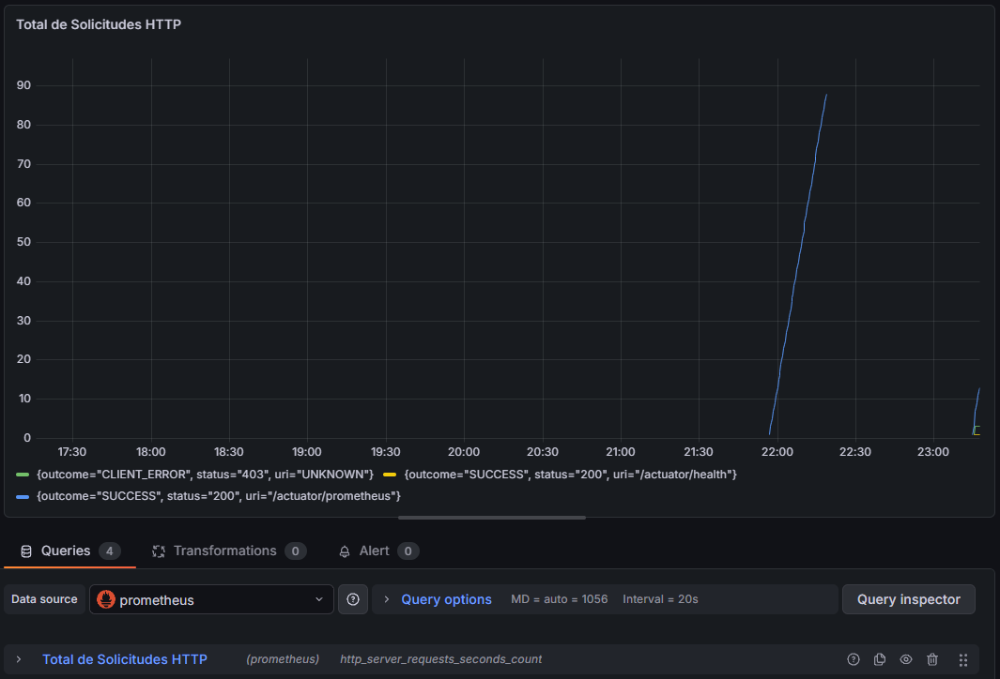

# Evaluación Final DevOps - Observabilidad e Infraestructura Backend

## Descripción

Este repositorio corresponde al backend del proyecto **PokeCardStore**, desarrollado con Spring Boot. La implementación aplica prácticas DevOps para automatizar la validación del código, contenerizar la aplicación, orquestar servicios con Docker Compose y monitorear el sistema con Prometheus y Grafana.

El objetivo es que el backend pueda ejecutarse de forma reproducible, con trazabilidad desde el repositorio, validaciones automáticas en CI/CD y observabilidad para revisar estado, rendimiento y disponibilidad.

---

## Tecnologías Utilizadas

- Java 21
- Spring Boot 4
- Spring Security
- PostgreSQL 16
- Maven Wrapper
- Docker
- Docker Compose
- GitHub Actions
- SonarCloud
- Spring Boot Actuator
- Micrometer Prometheus
- Prometheus
- Grafana

---

## Estrategia de Branching y Trazabilidad

El proyecto utiliza una estrategia basada en **Trunk-Based Development**, adaptada a un equipo pequeño. La idea es mantener una rama principal estable y trabajar con ramas temporales para cambios específicos.

### Ramas principales

- `main`: rama principal y estable del proyecto.
- `dev`: rama de integración para cambios en desarrollo.
- Ramas temporales: se usan para nuevas funcionalidades, correcciones o pruebas puntuales.

### Buenas prácticas del repositorio

- Crear commits descriptivos indicando el cambio realizado.
- Trabajar cambios importantes en ramas separadas.
- Integrar cambios mediante pull requests cuando corresponda.
- Revisar que el pipeline de GitHub Actions pase antes de considerar estable un cambio.
- Mantener documentadas las decisiones técnicas relevantes en el README o archivos de apoyo.

Esta estrategia permite trazabilidad porque cada modificación queda asociada a una rama, commit, pull request y ejecución del pipeline.

---

## Integración Continua con GitHub Actions

Se agregó un workflow de CI/CD en:

```text
.github/workflows/ci.yml
```

El pipeline se ejecuta en cada push hacia las ramas `main`, `dev`, `luisDevops`, y en cada pull request hacia `main` y `dev`.

### Validaciones del pipeline

- Descarga el código del repositorio.
- Configura JDK 21.
- Levanta PostgreSQL 16 como servicio de GitHub Actions.
- Ejecuta compilación y pruebas con Maven mediante `./mvnw -B clean verify`.
- Analiza calidad y seguridad del código con SonarCloud.
- Construye la imagen Docker del backend.
- Valida la configuración de Docker Compose con `docker compose config`.

Este flujo ayuda a detectar errores antes de integrar cambios y entrega evidencia automatizada de compilación, pruebas, calidad y configuración de infraestructura.

---

## Seguridad y Secretos

El pipeline utiliza SonarCloud para análisis de calidad y seguridad del código. El token de SonarCloud se debe configurar como secreto en GitHub:

```text
SONAR_TOKEN
```

---

## Arquitectura Implementada

El backend Spring Boot expone métricas mediante Actuator y Micrometer. Prometheus recolecta esas métricas desde el endpoint `/actuator/prometheus` y Grafana las visualiza en dashboards.

```text
Spring Boot Backend
        |
        v
Actuator + Micrometer
        |
        v
/actuator/prometheus
        |
        v
Prometheus
        |
        v
Grafana
```

Servicios principales:

- Backend Spring Boot.
- PostgreSQL.
- Prometheus.
- Grafana.

---

## Dockerfile

El proyecto incluye un `Dockerfile` para construir la imagen del backend.

La imagen usa una construcción multi-stage:

- `eclipse-temurin:21-jdk` para compilar la aplicación con Maven.
- `eclipse-temurin:21-jre` para ejecutar el `.jar` final.

El contenedor expone el puerto `8080` y ejecuta la aplicación con:

```bash
java -jar app.jar
```

Esto permite separar la etapa de build de la etapa de ejecución, dejando una imagen final más enfocada en correr la aplicación.

---

## Infraestructura Docker Compose

Se implementó Docker Compose para levantar todos los servicios necesarios:

- `postgres`: base de datos PostgreSQL 16.
- `backend`: aplicación Spring Boot construida desde el `Dockerfile`.
- `prometheus`: servicio de monitoreo.
- `grafana`: visualización de métricas.

### Puertos configurados

| Servicio | Puerto |
|---|---:|
| PostgreSQL | `5432` |
| Backend | `8080` |
| Prometheus | `9090` |
| Grafana | `3000` |

### Evidencia Docker Compose



---

## Comandos de Ejecución

### Levantar servicios

```bash
docker compose up -d
```

### Verificar servicios

```bash
docker compose ps
```

### Ver logs del backend

```bash
docker compose logs -f backend
```

### Detener servicios

```bash
docker compose down
```

### Reconstruir imágenes si hay cambios

```bash
docker compose up -d --build
```

---

## Troubleshooting

Si aparece un error indicando que un contenedor ya existe, por ejemplo:

```text
The container name "/pokecard-prometheus" is already in use
```

Se puede eliminar el contenedor anterior y levantar nuevamente:

```bash
docker rm -f pokecard-prometheus
docker compose up -d
```

Si ocurre con Grafana:

```bash
docker rm -f pokecard-grafana
docker compose up -d
```

Si se quiere limpiar el entorno completo del compose:

```bash
docker compose down
docker compose up -d --build
```

---

## Configuración de PostgreSQL

La base de datos PostgreSQL se ejecuta localmente mediante Docker.

| Parámetro | Valor |
|---|---|
| Base de datos | `pokecardstore` |
| Usuario | `pokecardstore_user` |
| Puerto | `5432` |

El backend se conecta a PostgreSQL dentro de Docker Compose mediante:

```text
jdbc:postgresql://postgres:5432/pokecardstore
```

El nombre `postgres` corresponde al nombre del servicio dentro de la red interna de Docker Compose.

---

## Observabilidad

### Spring Boot Actuator

Se habilitaron los siguientes endpoints:

```text
/actuator/health
/actuator/info
/actuator/prometheus
```

### Estado de salud de la aplicación



```text
http://localhost:8080/actuator/health
```

### Métricas Prometheus



```text
http://localhost:8080/actuator/prometheus
```

---

## Prometheus

Prometheus fue configurado en:

```text
observability/prometheus.yml
```

Recolecta métricas expuestas por el backend mediante:

```text
/actuator/prometheus
```

### Acceso

```text
http://localhost:9090
```

### Evidencia de Targets



En la sección `Status -> Targets` deben visualizarse los servicios en estado **UP**:

- `pokecard-backend`
- `prometheus`

---

## Grafana

Grafana fue configurado como plataforma de visualización y monitoreo de métricas.

### Acceso

```text
http://localhost:3000
```

### Credenciales

```text
Usuario: admin
Contraseña: devops
```

---

## Dashboard Implementado

Se creó un dashboard llamado:

```text
Dashboard de Observabilidad - PokeCardStore
```

### Vista General del Dashboard



### Disponibilidad de Servicios



Consulta utilizada:

```promql
up
```

Permite verificar si los servicios monitoreados se encuentran disponibles.

Esta métrica ayuda a detectar rápidamente caídas del backend, Prometheus u otros servicios configurados. Si el valor cambia de `1` a `0`, significa que Prometheus no puede alcanzar el servicio, por lo que sirve como primera alerta de indisponibilidad.

### Uso de Memoria JVM



Consulta utilizada:

```promql
sum(jvm_memory_used_bytes)
```

Permite visualizar el consumo de memoria utilizado por la aplicación Java.

Esta métrica ayuda a identificar si el backend está usando demasiada memoria o si el consumo aumenta de forma constante con el tiempo. Esto puede indicar problemas de rendimiento, fugas de memoria o necesidad de ajustar recursos antes de pasar a un ambiente productivo.

### Consumo de CPU del Backend



Consulta utilizada:

```promql
process_cpu_usage
```

Permite monitorear el uso de CPU de la aplicación.

Esta métrica ayuda a revisar la carga de procesamiento del backend. Un uso alto de CPU puede indicar demasiadas solicitudes, procesos costosos, consultas ineficientes o la necesidad de escalar la aplicación con más recursos o más réplicas.

### Total de Solicitudes HTTP



Consulta utilizada:

```promql
http_server_requests_seconds_count
```

Permite visualizar la cantidad total de solicitudes procesadas por el backend.

Esta métrica ayuda a conocer el nivel de uso de la API. Permite observar si el tráfico aumenta, si existen periodos de mayor demanda y si el backend está recibiendo solicitudes correctamente. También sirve como base para analizar rendimiento junto con métricas de CPU, memoria y tiempos de respuesta.

---

## Validación del Sistema

Para validar que el sistema está funcionando correctamente:

1. Levantar servicios:

```bash
docker compose up -d --build
```

2. Revisar contenedores:

```bash
docker compose ps
```

3. Revisar salud del backend:

```text
http://localhost:8080/actuator/health
```

4. Revisar targets de Prometheus:

```text
http://localhost:9090
```

5. Revisar dashboard de Grafana:

```text
http://localhost:3000
```

---

## Resultado

Se implementó una solución de infraestructura y observabilidad para el backend del proyecto PokeCardStore utilizando herramientas estándar del ecosistema DevOps.

La solución permite:

- Supervisar el estado de salud de la aplicación.
- Monitorear métricas de rendimiento.
- Visualizar información en tiempo real mediante dashboards.
- Automatizar validaciones con GitHub Actions.
- Construir la imagen Docker del backend.
- Orquestar backend, base de datos y herramientas de monitoreo con Docker Compose.
- Facilitar análisis, diagnóstico y futuras mejoras hacia despliegues cloud.

---

## Autores

**Geraldine Carolina Becerra**  
**Luis Guillermo Muñoz Soto**

Implementación de infraestructura y observabilidad:

- PostgreSQL
- Dockerfile
- Docker Compose
- GitHub Actions
- SonarCloud
- Spring Boot Actuator
- Micrometer Prometheus
- Prometheus
- Grafana
- Dashboard de monitoreo
